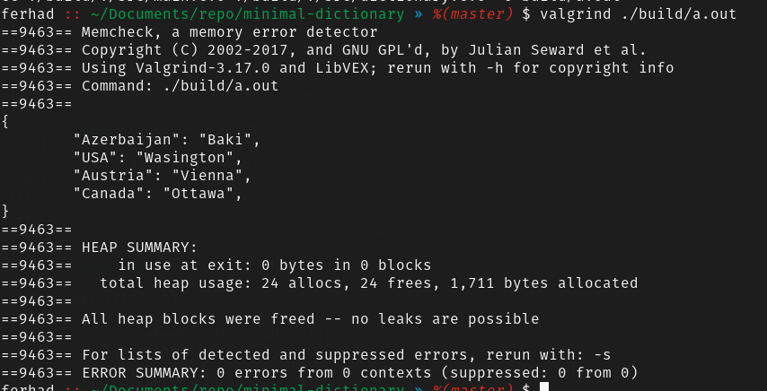

### Overview
  Minimal implementation of Dictionary data structure that uses close addressing technique

### Key-Value
  Supports only string-string key-value pair:
```
  dict = {
    "key1": "value1",
    "key2": "value2"
  }
```

### Collisions
  Resolves collission issues with chaining (close addressing) technique using linked list

### Memory
  There is no any memory leak during "put", "delete" and other memory related operations

**Valgrind result:**



***NOTE:*** **free() shouldn't be called for releasing dictionary. Its nodes also should be released. That's why call free_dict() (which behind the scenes, it calls clear_dict() function to release its nodes before calling free()) or call clear_dict() manually before free()**

***NOTE2:*** **There are 2 functions (key_set() and value_set() which returns set of available key/value in dictionary) that need to be released after finishing work with sets. This can be done with free_set() function or manually**

### Functions
- create_dictionary
- free_dict

- put
- get
- get_or_default
- replace
- delete
- contains_key
- contains_value
- empty
- clear_dict
- print_dict
- key_set
- value_set
- free_set
